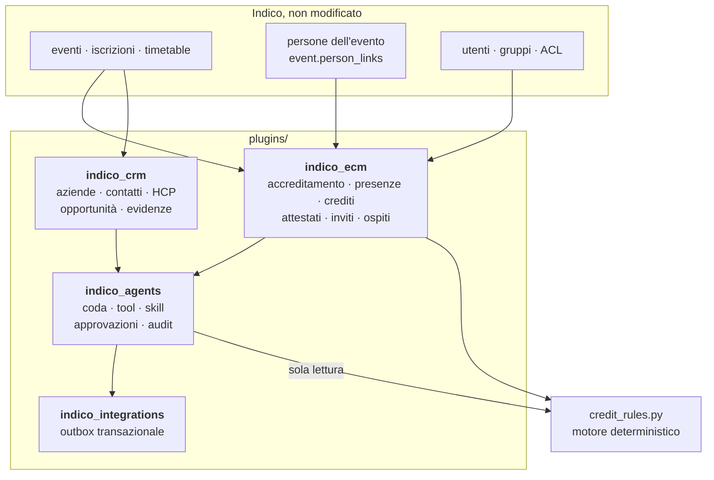

# Gestionale ECM — fork di Indico con CRM e agenti incorporati

Questo repository **è** il programma. Indico resta intatto e quattro plugin
proprietari gli aggiungono ciò che serve a un provider ECM. Lo stack che lo
esegue vive altrove, in `../indico-deploy`, che ha un `CLAUDE.md` suo.

Progettazione e razionale in [`docs/ecm-crm/`](docs/ecm-crm/), in particolare
[`06-stato-produzione.md`](docs/ecm-crm/06-stato-produzione.md) per cosa è
verificato e [`05-da-cyberbrain.md`](docs/ecm-crm/05-da-cyberbrain.md) per cosa
è stato portato dal gestionale precedente.

## I tre principi che non si negoziano

1. **Il core di Indico non si tocca.** Tutto passa da segnali, blueprint e
   modelli in schemi `plugin_*`. Aggiornare Indico deve restare possibile.
2. **L'API non decide.** Un'iscrizione o un check-in creano un `AgentTask`;
   nessuna chiamata sincrona a un modello linguistico nel percorso HTTP.
3. **I crediti sono deterministici.** `indico_ecm.services.credit_rules` è
   codice puro, versionato e testato, senza dipendenze da Indico e senza
   modelli. Gli agenti lo interrogano in sola lettura.

## La mappa



| Plugin | Schema | Tabelle | Rotte |
|---|---|---|---|
| `indico_ecm` | `plugin_ecm` | 14 | 21 |
| `indico_crm` | `plugin_crm` | 9 | 5 |
| `indico_agents` | `plugin_agents` | 5 | 3 |
| `indico_integrations` | `plugin_integrations` | 1 | — |

## Dove sta cosa, in `indico_ecm/services/`

I servizi sono funzioni pure salvo dove indicato: niente Indico dentro, quindi
si provano senza database.

| File | Cosa decide |
|---|---|
| `programme.py` | Legge il Progetto Formativo: titolo, date, sede, crediti, partecipanti, orari, relatori |
| `automator.py` | Ci aggiunge codice evento, specialità, formato; costruisce la cartella evento |
| `specialty.py` | Specialità medica e palette; formato ECM dell'attività |
| `naming.py` | Nome e percorso della cartella sul disco condiviso |
| `credit_rules.py` | Minuti di presenza, soglie, arrotondamenti, verdetto con i motivi |
| `eligibility.py` | Se un iscritto può ricevere i crediti |
| `certificates.py` · `certificate_render.py` | Numerazione, emissione, revoca; PDF con QR e impronta |
| `engagement_letter.py` | Saluti, importi in lettere, ritenuta 20%, sesso da codice fiscale |
| `faculty.py` | I relatori dell'evento e le loro lettere di incarico |
| `letters.py` · `invitations.py` · `costs.py` | Stampa unione ospedali, lettere, costi di ospitalità |
| `guests.py` | Lista ospiti dello sponsor: navette, coperti, righe scartate motivate |
| `templates.py` | 14 template email versionati, 2 template Word |
| `mail_draft.py` | Messaggio `.eml` con allegati: il client di posta lo apre come bozza, nessun invio automatico |
| `transfer_export.py` | La lista ospiti processata in un foglio XLSX |
| `statistics.py` | Totali, per città, per mese, eventi con voci in ritardo, export XLSX |
| `deliverables.py` · `reminders.py` | Checklist con scadenze, promemoria che non si perdono |
| `legacy_import.py` · `archive.py` | Import dell'archivio del gestionale precedente; export nello stesso formato |
| `hotel.py` | Servizi richiesti all'albergo, dedotti dal programma: riempiono il template `hotel_quote` e il tool `prepare_hotel_brief` |

## Cosa arriva nel CRM, e da dove

Il CRM non si popola da solo: ci scrivono i segnali di Indico, elencati in
`indico_crm/plugin.py`. Se un dato non compare fra i contatti, la domanda giusta
è quale segnale avrebbe dovuto portarcelo.

| Origine | Segnale | Esito |
|---|---|---|
| Iscrizione a un evento | `registration_created` | contatto collegato, o task `contact_resolution` se l'identità non è certa |
| Relatori dell'evento | `person_updated` | contatto collegato, o task `faculty_review` |
| Affiliazione dichiarata in iscrizione | — | struttura sanitaria creata o ritrovata, se `autocreate_companies` è attivo |
| Foglio ospedali della stampa unione | — | ogni ospedale diventa `CompanyKind.healthcare_org`, lo sponsor `CompanyKind.sponsor`, legati all'evento |
| Proposte degli agenti | approvazione | `create_contact` / `link_contact` |

Le pagine di gestione stanno in `/admin/crm/…`: contatti (con creazione),
scheda contatto (modifica, note, consensi, timeline, collegamenti), aziende
(con creazione), scheda azienda, opportunità (creazione e filtro aperte/tutte).
I consensi sono append-only: revocare aggiunge una riga, la storia è la prova.

Gli interruttori nelle impostazioni del plugin sono letti davvero:
`autolink_registrations` e `autocreate_companies` spengono il rispettivo
comportamento. `organization_name` **non è ancora usato da nulla**.

**Non ci arrivano** gli ospiti della lista sponsor — sono logistica, non anagrafica —
né i relatori estratti da un Progetto Formativo:
`/admin/ecm/automator` è una pagina di amministrazione senza evento, costruisce
la cartella prima che l'evento esista, e non crea `EventPerson`. 

## Comandi

```bash
# logica pura, ovunque, senza database
cd plugins/indico_ecm    && PYTHONPATH=. python -m pytest indico_ecm    -q -c /dev/null -p no:indico
cd plugins/indico_crm    && PYTHONPATH=. python -m pytest indico_crm    -q -c /dev/null -p no:indico
cd plugins/indico_agents && PYTHONPATH=. python -m pytest indico_agents -q -c /dev/null -p no:indico
# 482 · 24 · 62

make lint-py     # isort, ruff, backrefs
```

`-p no:indico` non è facoltativo: `indico/testing/pytest_plugin.py` imposta
`INDICO_CONFIG = os.devnull` all'import ed è registrato come entry point
`pytest11`, quindi si carica anche senza `conftest.py`. Senza escluderlo
l'applicazione parte con i soli valori predefiniti e ogni test fallisce in setup.

### Integrazione, con PostgreSQL vero

Non si esegue da qui: gira nello stack, in un container usa-e-getta, contro un
database usa-e-getta.

```bash
cd ../indico-deploy/ecm-stack
docker compose run --rm --no-deps -T indico-web bash -s < run-integration.sh
# 59 passed
```

## Regole di lavoro

**Le migrazioni si generano dai modelli**, che sono la fonte di verità. Dopo una
modifica a un modello va prodotta una nuova revisione, non modificata quella
iniziale:

```bash
indico db --plugin <ecm|crm|agents|integrations> migrate -m 'cosa cambia'
indico db --plugin <ecm|crm|agents|integrations> upgrade
```

**Nelle pagine si usano le classi di Indico**, non stili inline: `i-button`,
`i-label accept|warning|danger|disabled`, `i-table-widget`, `i-box`, `i-form`,
`*-message-box`, `text-not-important`, `toolbar`/`group`. Le poche regole senza
equivalente stanno in `plugins/indico_ecm/indico_ecm/static/ecm.css`, servita da
`/static/plugins/ecm/ecm.css` — il blueprint del plugin espone la sua cartella
`static/` da sé, non serve un bundle webpack.

**Una regola di estrazione si corregge con un test che riproduce il documento
sbagliato**, non a intuito. `services/programme_test.py` usa i testi con cui il
gestionale precedente prova il proprio estrattore.

## Cosa non indovinare mai

Quattro casi in cui la piattaforma dichiara di non sapere invece di scegliere.
Sono regole, non prudenza: ognuna nasce da un dato sbagliato su documenti veri.

1. **Il sesso di una persona.** Senza codice fiscale e senza un titolo declinato
   («Dott.ssa», «Prof.ssa») la lettera si apre con `Spett.le`. `Dott.` è la
   forma maschile abbreviata: usarla su una donna sbaglia il genere.
2. **Nome e cognome quando la riga non lo dice.** `Mario Rossi` e `Rossi Mario`
   sono gli stessi caratteri. Senza un segnale — la virgola, il cognome in
   maiuscolo — la piattaforma lo dichiara e offre di invertirli.
3. **Il formato dell'attività.** Se il documento non lo dichiara,
   `identify_event_format` restituisce stringa vuota e la cartella prende il
   nome dalla città. Il formato finisce nel nome della cartella sul disco
   condiviso: sbagliarlo archivia un evento residenziale sotto `FAD-ASINCRONA`.

4. **Il colore a schermo di una palette.** Il provider ha specificato la
   quadricromia; una versione precedente del porting aveva aggiunto anche un
   hex, preso dalla tavolozza predefinita di Tailwind e di tinta diversa dal
   CMYK accanto — teal in stampa, blu a video. Senza il profilo ICC dello studio
   non esiste una conversione corretta: il brief consegna il CMYK e dice a chi
   tocca convertirlo.

E due che sembrano nomi ma non lo sono: una riga sola sotto una sessione, senza
ruolo e senza titolo (`Disease Modifying Treatment`), e una riga tutta in
maiuscolo (`PERCORSO GRUPPO DI MIGLIORAMENTO`).

## Cosa non c'è ancora

Report e statistiche, assistente vocale, generazione brochure e PPTX,
`research_person`, gli adapter concreti verso Gmail e Calendar. L'outbox
transazionale esiste ma `_HANDLERS` è vuoto: **nessuna email parte davvero**, le
pagine preparano il testo e lo mostrano.

Gli agenti restano spenti finché non si attiva l'interruttore nel cruscotto: il
valore predefinito è `enabled = False`.
